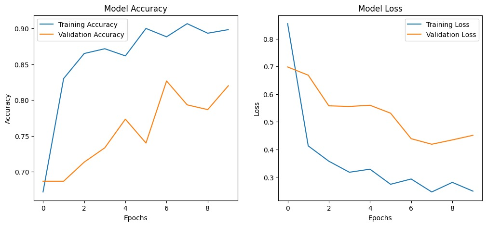

# OroLight: Oral Cancer Detection using Deep Learning

**OroLight** is a web-based deep learning application that classifies oral histopathology images as **cancerous** or **non-cancerous**. It integrates a trained **InceptionResNetV2** model within a Flask app and provides Grad-CAM visualizations for interoperability.

 ---

## Features

* ✅ Upload and classify oral histopathology images
* 🧠 Uses **InceptionResNetV2** for high accuracy
* 🌈 Includes **Grad-CAM** to visualize model attention
* 💻 Fully styled UI with animations
* 📈 Training notebook with graphs and metrics

---

## Model Training and Performance

The model is trained on the **[Oral Cancer Dataset](https://www.kaggle.com/datasets/zaidpy/oral-cancer-dataset)** by ZaidPy.

> Achieved **90%** accuracy using transfer learning and fine-tuning.

---

## 🔧 Setup Instructions

### 1. Clone the Repository

```bash
git clone https://github.com/Jasmine5220/orolight.git
cd orolight
```

### 2. Create a Virtual Environment
```bash
python -m venv venv
source venv/bin/activate      # MacOS/Linux
venv\Scripts\activate         # Windows
```

### 3. Download the Dataset
1. Go to the dataset page:
   🔗 [https://www.kaggle.com/datasets/zaidpy/oral-cancer-dataset](https://www.kaggle.com/datasets/zaidpy/oral-cancer-dataset)
2. Download the zip folder of the dataset.

### 4. Train the Model
Run the training notebook.

This will:
* Load and preprocess images
* Train an InceptionResNetV2-based classifier
* Save the best model as `best_model.h5` in `orolight` folder

### 5. Move the Model to the Correct Directory
After training completes:
```bash
mv best_model.h5 oral_cancer_app/model/
```

### 6. Go to Flask App and Install Required Packages
```bash
cd oral_cancer_app
pip install -r requirements.txt
```
Or manually:
```bash
pip install flask tensorflow keras opencv-python matplotlib numpy pandas
```

### 7. Run the Flask App
```bash
python app.py
```

Visit `http://127.0.0.1:5000` in your browser.

---

## 🖼️ Example Test Images

Inside `Tests/`, you’ll find:
* `real-test-1.jpg`
* `real-test-2.jpg`
These are sample images(taken in Jabalpur Medical College), you can upload via the web app to test the model.

---

## 📊 Accuracy Visualization


*Training and validation accuracy plotted over epochs.*

---

## 📁 Project Structure

```
oral_cancer_app/
├── model/
│   └── best_model.h5          # ✅ Saved trained model (moved here after training)
├── static/
│   ├── gradcam/               # Grad-CAM visualizations
│   ├── uploads/               # Uploaded images for prediction
│   ├── device.jpg
│   ├── heading.png
│   ├── scripts.js
│   └── styles.css
├── templates/
│   └── index.html             # Main UI
├── app.py                     # Flask backend
├── Tests/
│   ├── real-test-1.jpg
│   └── real-test-2.jpg
├── training-and-testing.ipynb # 📓 Training and evaluation notebook
```

---

### 📜 This project was part of EDP (DFP-24).
